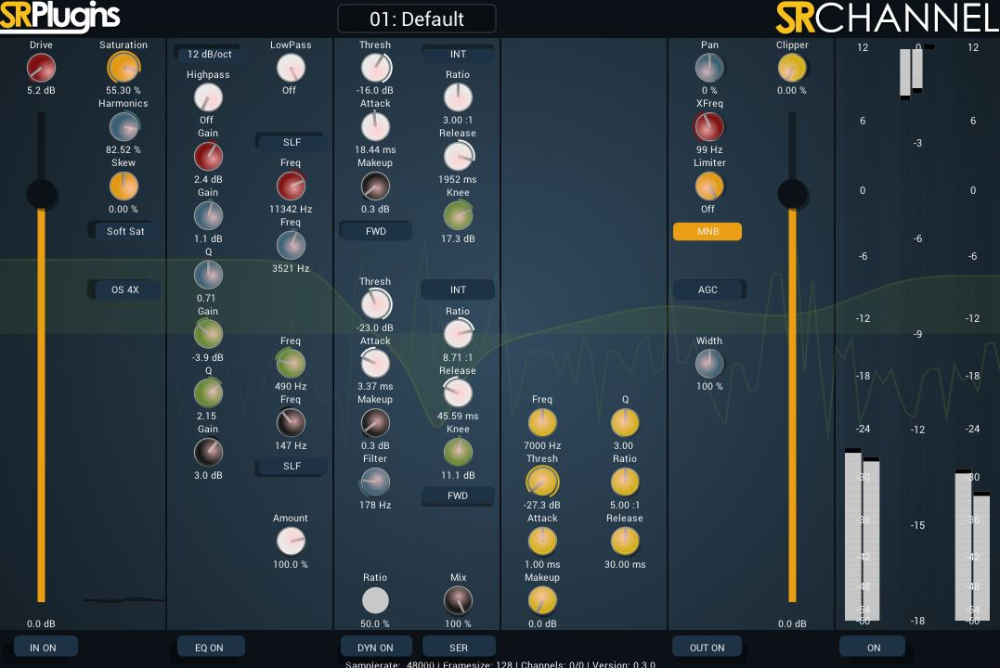
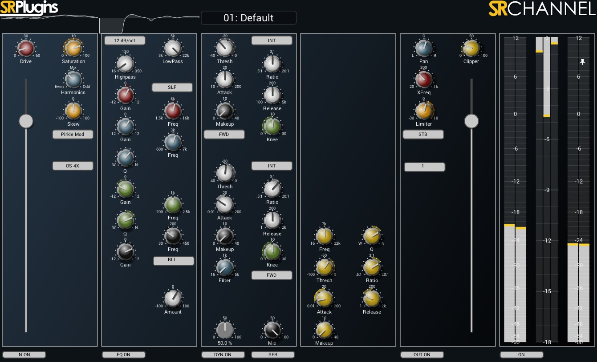

# Important Note

SRChannel is under heavy development. Use the code with care and and your own risk.

---

# Introduction

Intentionally started as (and still being) a project to learn C++ and audio plugin programming, SRChannel as a part of SRPlugins is an ever growing VST/VST3 plugin project. For included features see the code, this README file or the projects tab. It uses the WDL-OL IPlug2 plugin framework as well as, besides own processing algorithms, different open source filter/processing classes provided under GnuGPL or MIT licence. Consequently it is and will remain free and open source.

Binaries can be found under the Release tab.

~~Additionally, the wiki should be a resource for DSP in general and implemetation methods for WDL-OL.~~

Feel free to contribute code and/or ideas.

---

# Features

SRChannel is a channel strip plugin, including input waveshapers, a four band parametric equalizer plus highpass and lowpass, two compressors/expanders that can be used parralel or serial, output limiter, clipper, panning with crossover, and automatic gain control as well as multiple metering options.

Some of the features of the WDL-OL version (0.1.2-a) aren't implemented yet

~~For a more detailed overview of the current state and implemented features see the "Projects" tab above.~~

---

# Compile

Clone this repository to your "IPlug2" folders first level (not into any subdirectory). 
If you want to use project files, only VS solution is properly linked. Includes for xcode must be added manually.

---

# External libraries used or modified

* WDL-OL IPlug2 framework
* EarLevels Biquad c++ class
* chunkware simple source dynamics classes

_italic_: not implemented yet

(may not be complete yet)

---

# Disclaimers

Since this is a hobby project and I have limited resources at hand, see following facts:

* If you see me violating your or any others copyrights, please contact me instantly, I did not intend that. Same goes for any advice concerning the copyright statements on this repository.
* Several third party libraries used in this project are still not declared in the code. I will update that as soon as possible.
* I test the plugin with DDMF PluginDoctor and Cockos REAPER on a x64 Windows machine. Besides I won't provide support at all, I also can't provide help for other platforms, configurations or hosts not mentioned above due to limited talent and knowledge.
* There will be no MacOS AU/VST until I'll buy a mac (which most likely will never happen) or you'll compile your own. XCode project is included but not properly set up. LinuxVST is on the roadmap.
* Due to above mentioned lack of talent, advice is highly appreciated.

If no other copyrights listed:

Copyright 2019 Johannes Menzel

Permission is hereby granted, free of charge, to any person obtaining a copy of this software and associated documentation files (the "Software"), to deal in the Software without restriction, including without limitation the rights to use, copy, modify, merge, publish, distribute, sublicense, and/or sell copies of the Software, and to permit persons to whom the Software is furnished to do so, subject to the following conditions:

The above copyright notice and this permission notice shall be included in all copies or substantial portions of the Software.

THE SOFTWARE IS PROVIDED "AS IS", WITHOUT WARRANTY OF ANY KIND, EXPRESS OR IMPLIED, INCLUDING BUT NOT LIMITED TO THE WARRANTIES OF MERCHANTABILITY, FITNESS FOR A PARTICULAR PURPOSE AND NONINFRINGEMENT. IN NO EVENT SHALL THE AUTHORS OR COPYRIGHT HOLDERS BE LIABLE FOR ANY CLAIM, DAMAGES OR OTHER LIABILITY, WHETHER IN AN ACTION OF CONTRACT, TORT OR OTHERWISE, ARISING FROM, OUT OF OR IN CONNECTION WITH THE SOFTWARE OR THE USE OR OTHER DEALINGS IN THE SOFTWARE. YOU WILL USE THIS SOFTWARE AT YOUR OWN RISK.

# Screenshot

This is the current state (0.3.0-alpha). It has easier controls for lower resource footprint.

This was version 0.2.1-alpha:

And this was the old version of it, made with WDL-OL. You'll notice the GUI is still a little messy.:

